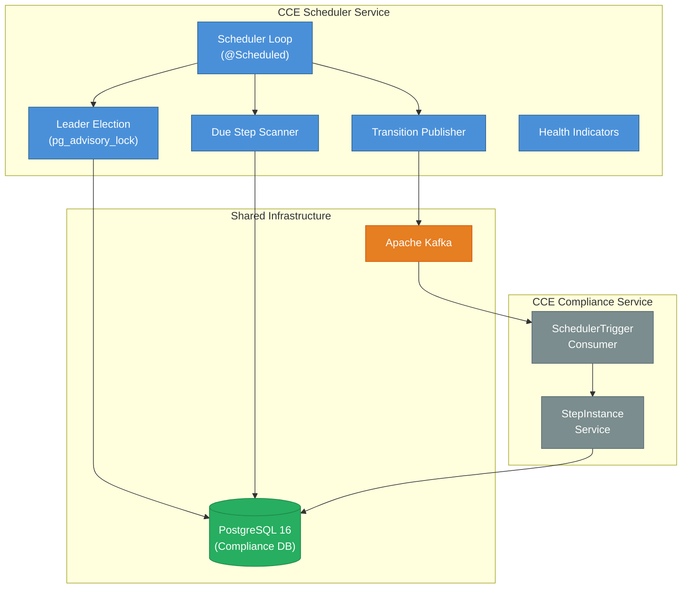

# Architecture & Design

## 1. System Context

The **CCE Scheduler Service** is a headless background service within the CCE platform. It drives time-based step state transitions by polling the Compliance Service's `step_instance` table and publishing transition requests to Kafka. It has **no REST API endpoints** — communication with the Compliance Service is exclusively via Kafka.



**This service does NOT handle:** event ingestion, protocol matching, step completion, deviation detection, analytics, authentication, or any REST API operations.

---

## 2. Technology Stack

| Concern | Technology | Version |
|---------|------------|---------|
| Language | Java | 21 (LTS) |
| Framework | Spring Boot | 3.4.x |
| Build tool | Gradle | 8.x |
| Database | PostgreSQL | 16+ (shared with Compliance Service) |
| Message broker | Apache Kafka | 3.7+ (KRaft mode) |
| DB access | Spring Data JPA + Hibernate | (Spring Boot managed) |
| DB migration | Flyway | (Spring Boot managed) |
| Connection pool | HikariCP | (Spring Boot default) |
| Observability | Micrometer + Prometheus | (Spring Boot managed) |
| Testing | JUnit 5, Testcontainers | |

### Key Gradle Dependencies

```groovy
// Spring Boot starters
implementation 'org.springframework.boot:spring-boot-starter'
implementation 'org.springframework.boot:spring-boot-starter-data-jpa'
implementation 'org.springframework.boot:spring-boot-starter-actuator'
implementation 'org.springframework.boot:spring-boot-starter-web'  // for actuator endpoints
implementation 'org.springframework.kafka:spring-kafka'

// Database
runtimeOnly 'org.postgresql:postgresql'
implementation 'org.flywaydb:flyway-core'
implementation 'org.flywaydb:flyway-database-postgresql'

// Observability
implementation 'io.micrometer:micrometer-registry-prometheus'

// Testing
testImplementation 'org.springframework.boot:spring-boot-starter-test'
testImplementation 'org.springframework.kafka:spring-kafka-test'
testImplementation 'org.testcontainers:postgresql'
testImplementation 'org.testcontainers:kafka'
testImplementation 'org.testcontainers:junit-jupiter'
```

---

## 3. Package Structure

```
src/main/java/org/openphc/cce/scheduler/
├── SchedulerServiceApplication.java          # @SpringBootApplication + @EnableScheduling
├── config/
│   ├── SchedulerProperties.java              # @ConfigurationProperties(prefix = "cce.scheduler")
│   ├── SchedulingConfig.java                 # Thread pool (2 threads)
│   ├── JpaConfig.java                        # JPA/Hibernate settings
│   ├── KafkaProducerConfig.java              # Kafka producer factory
│   └── ObservabilityConfig.java              # MeterBinder for custom metrics
├── domain/
│   ├── model/
│   │   ├── StepInstance.java                 # Read-only entity (@Immutable)
│   │   ├── SchedulerLease.java               # Singleton lease entity
│   │   └── enums/
│   │       └── StepState.java                # PENDING, DUE, OVERDUE, MISSED, COMPLETED, SKIPPED
│   └── repository/
│       ├── StepInstanceRepository.java       # Read-only queries
│       └── SchedulerLeaseRepository.java     # Lease upsert
├── engine/
│   ├── SchedulerLoop.java                    # @Scheduled main loop with leader guard
│   ├── DueStepScanner.java                   # PostgreSQL query + transition determination
│   ├── DueStep.java                          # Record: stepInstanceId, transitionType, metadata
│   └── TransitionPublisher.java              # Orchestrates Kafka publish per DueStep
├── health/
│   └── LeaderHealthIndicator.java            # Custom health indicator for leader status
├── kafka/
│   ├── SchedulerTriggerMessage.java          # Kafka message record
│   └── SchedulerTriggerProducer.java         # Kafka template wrapper
└── leader/
    └── LeaderElection.java                   # pg_advisory_lock lifecycle

src/main/resources/
├── application.yml
├── application-docker.yml
└── db/migration/
    └── V1__create_scheduler_lease.sql

src/test/java/org/openphc/cce/scheduler/      # Unit tests
src/integrationTest/java/org/openphc/cce/scheduler/  # Integration tests
```

**Total:** ~19 source files across 8 packages.

---

## 4. Component Interactions

### 4.1 Scan-Publish Cycle

The core loop runs on a `@Scheduled(fixedDelay)` cadence (default: 5 seconds). The `fixedDelay` ensures no overlap — the next cycle starts only after the previous cycle completes.

```
1. Leader check (pg_advisory_lock held?)
   - If not leader → skip this cycle, return immediately
2. DueStepScanner.scan(batchSize)
   - Query step_instance for rows where time thresholds are met
   - Determine transition type for each row
   - Return List<DueStep>
3. TransitionPublisher.publish(dueSteps)
   - For each DueStep: build SchedulerTriggerMessage, publish to Kafka synchronously
   - Track success/failure counts
4. Update scheduler_lease heartbeat
5. Record metrics (scan duration, batch size, transitions by type)
6. Wait fixedDelay → repeat
```

### 4.2 Leader Election Lifecycle

```
Startup:
1. Create dedicated JDBC connection (outside HikariCP pool)
2. Call pg_try_advisory_lock(lockKey) — non-blocking
3. If acquired → leader = true, update scheduler_lease
4. If not acquired → leader = false, enter standby

Standby:
- Retry pg_try_advisory_lock every leaderRetryInterval (default: 5s)
- Scan loop skips processing on each cycle

Failover:
- When leader instance dies, PG connection drops, advisory lock is released
- Standby instance acquires lock on next retry → becomes leader

Shutdown (@PreDestroy):
- Release advisory lock
- Close dedicated connection
```

### 4.3 Shared Database Access

The Scheduler connects to the **same PostgreSQL database** (`cce_collector`) as all other CCE services. The database is deployed by the CCE Collector Service.

| Table | Owner | Scheduler Access | Purpose |
|---|---|---|---|
| `step_instance` | Compliance Service | **Read-only** | Query for due transitions |
| `scheduler_lease` | Scheduler Service | **Read-write** | Leader election + heartbeat |
| All other tables | Compliance Service | **No access** | Not used by Scheduler |

**Important:** The Scheduler uses `@Immutable` on its `StepInstance` entity to prevent accidental writes. The actual state transitions are performed by the Compliance Service after consuming `SchedulerTriggerMessage` from Kafka.

---

## 5. Threading Model

| Thread Pool | Size | Purpose |
|---|---|---|
| `scheduler-pool` | 2 | @Scheduled task execution (scan loop + heartbeat) |
| HikariCP | 5 | JDBC connections for step_instance queries and lease updates |
| Kafka producer I/O | 1 | Kafka message publishing (synchronous) |
| Advisory lock | 1 | Dedicated JDBC connection for `pg_advisory_lock` (not from HikariCP) |

---

## 6. Error Handling

| Error Source | Handling | Impact |
|---|---|---|
| PostgreSQL unreachable | Log error, skip this cycle, retry on next interval | Service remains running; catches up when DB recovers |
| Kafka broker unreachable | Log error per message, continue to next step in batch | Some transitions delayed; Kafka retries handle transient failures |
| Advisory lock lost | Detect on next heartbeat, set leader=false, enter standby | Another instance takes over |
| Stale step (already transitioned) | Compliance Service ignores duplicate `SchedulerTriggerMessage` | No impact — idempotent consumer |
| Exception in scan loop | Catch-all in `@Scheduled` method — never terminates the scheduled task | Logged, metrics incremented, next cycle proceeds normally |

---

## 7. Observability

### 7.1 Metrics (Micrometer)

| Metric | Type | Tags | Description |
|---|---|---|---|
| `cce.scheduler.scan.duration` | Timer | — | Time spent per scan cycle |
| `cce.scheduler.scan.steps` | Counter | `transition_type` | Steps found per transition type |
| `cce.scheduler.publish.success` | Counter | `transition_type` | Successful Kafka publishes |
| `cce.scheduler.publish.failure` | Counter | `transition_type` | Failed Kafka publishes |
| `cce.scheduler.leader.status` | Gauge | — | 1 = leader, 0 = standby |
| `cce.scheduler.cycle.count` | Counter | — | Total scan cycles executed |

### 7.2 Health Indicators

| Indicator | Details |
|---|---|
| `leaderElection` | UP if leader election is functioning (regardless of leader/standby status). Reports `leader: true/false`, `lastHeartbeat`. |
| `db` (auto) | PostgreSQL connectivity |
| `kafka` (auto) | Kafka broker connectivity |

### 7.3 Structured Logging

```
correlationId: sched-DUE_TO_OVERDUE-770e8400
stepInstanceId: 770e8400-e29b-41d4-a716-446655440002
transitionType: DUE_TO_OVERDUE
leaderStatus: true
```

---

## 8. Scaling & Deployment

- **Active-standby:** Deploy 2+ instances. Only the leader processes; standby instances wait for advisory lock.
- **Failover time:** ≤ `leaderRetryInterval` (default 5 seconds).
- **No horizontal scaling of processing** — only one instance is active at a time. This is by design to prevent duplicate transitions.
- **Stateless between runs** — all state is in PostgreSQL. An instance can be replaced at any time.
