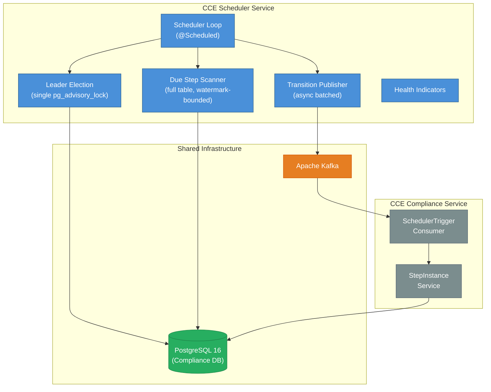

# Architecture & Design

## 1. System Context

The **CCE Scheduler Service** is a headless background service within the CCE platform. It drives time-based step state transitions by polling the Compliance Service's `step_instance` table and publishing transition requests to Kafka. It has **no REST API endpoints** — communication with the Compliance Service is exclusively via Kafka.



**This service does NOT handle:** event ingestion, protocol matching, step completion, deviation detection, analytics, authentication, or any REST API operations.

---

## 2. Technology Stack

| Concern | Technology | Version |
|---------|------------|---------|
| Language | Java | 21 (LTS) |
| Framework | Spring Boot | 3.4.x |
| Build tool | Gradle | 8.x |
| Database | PostgreSQL | 16+ (shared with Compliance Service) |
| Message broker | Apache Kafka | 3.7+ (KRaft mode) |
| DB access | Spring Data JPA + Hibernate | (Spring Boot managed) |
| DB migration | Flyway | (Spring Boot managed) |
| Connection pool | HikariCP | (Spring Boot default) |
| Observability | Micrometer + Prometheus | (Spring Boot managed) |
| Testing | JUnit 5, Testcontainers | |

### Key Gradle Dependencies

```groovy
// Spring Boot starters
implementation 'org.springframework.boot:spring-boot-starter'
implementation 'org.springframework.boot:spring-boot-starter-data-jpa'
implementation 'org.springframework.boot:spring-boot-starter-actuator'
implementation 'org.springframework.boot:spring-boot-starter-web'  // for actuator endpoints
implementation 'org.springframework.kafka:spring-kafka'

// Database
runtimeOnly 'org.postgresql:postgresql'
implementation 'org.flywaydb:flyway-core'
implementation 'org.flywaydb:flyway-database-postgresql'

// Observability
implementation 'io.micrometer:micrometer-registry-prometheus'

// Testing
testImplementation 'org.springframework.boot:spring-boot-starter-test'
testImplementation 'org.springframework.kafka:spring-kafka-test'
testImplementation 'org.testcontainers:postgresql'
testImplementation 'org.testcontainers:kafka'
testImplementation 'org.testcontainers:junit-jupiter'
```

---

## 3. Package Structure

```
src/main/java/org/openphc/cce/scheduler/
├── SchedulerServiceApplication.java          # @SpringBootApplication + @EnableScheduling
├── config/
│   ├── SchedulerProperties.java              # @ConfigurationProperties(prefix = "cce.scheduler")
│   ├── SchedulingConfig.java                 # Thread pool (2 threads)
│   ├── JpaConfig.java                        # JPA/Hibernate settings
│   ├── KafkaProducerConfig.java              # Kafka producer factory
│   └── ObservabilityConfig.java              # MeterBinder for custom metrics
├── domain/
│   ├── model/
│   │   ├── StepInstance.java                 # Read-only entity (@Immutable)
│   │   ├── SchedulerLease.java               # Leader heartbeat entity (single row)
│   │   ├── ScanCursor.java                   # Scan watermark entity (single cursor)
│   │   └── enums/
│   │       └── StepState.java                # PENDING, DUE, OVERDUE, MISSED, COMPLETED, SKIPPED
│   └── repository/
│       ├── StepInstanceRepository.java       # Read-only query (watermark-bounded)
│       ├── SchedulerLeaseRepository.java     # Lease upsert
│       └── ScanCursorRepository.java         # Keyset cursor upsert (monotonic, ROW guard)
├── engine/
│   ├── SchedulerLoop.java                    # @Scheduled main loop with leader guard; advances watermark
│   ├── DueStepScanner.java                   # PostgreSQL query + transition determination; reads watermark
│   ├── ScanCursorService.java                # Reads/advances the scan watermark
│   ├── DueStep.java                          # Record: stepInstanceId, transitionType, metadata
│   └── TransitionPublisher.java              # Fires all sends, then awaits the batch
├── health/
│   └── LeaderHealthIndicator.java            # Custom health indicator for leader status
├── kafka/
│   ├── SchedulerTriggerMessage.java          # Kafka message record
│   └── SchedulerTriggerProducer.java         # Async Kafka send (returns CompletableFuture)
└── leader/
    └── LeaderElection.java                   # Single pg_advisory_lock lifecycle

src/main/resources/
├── application.yml
├── application-docker.yml
└── db/migration/
    ├── V1__create_scheduler_lease.sql            # leader heartbeat (single row, id = 0)
    └── V2__scheduler_scan_cursor.sql             # scan cursor + step_instance scan indexes

src/test/java/org/openphc/cce/scheduler/      # Unit tests
src/integrationTest/java/org/openphc/cce/scheduler/  # Integration tests
```

---

## 4. Component Interactions

### 4.1 Scan-Publish Cycle

The core loop runs on a `@Scheduled(fixedDelay)` cadence (default: 10 seconds). The `fixedDelay` ensures no overlap — the next cycle starts only after the previous cycle completes. Only the instance that currently holds the leader lock scans; all other instances stay on standby.

```
1. Leader check (do we hold the advisory lock?)
   - If not leader → skip this cycle, return immediately
2. DueStepScanner.scan()
   a. Read the scan cursor (watermark, watermark_id) from
      scheduler_scan_cursor (epoch + min-UUID if none)
   b. Query step_instance (whole table) for rows where time thresholds are met
      AND the row sorts STRICTLY AFTER (watermark, watermark_id) in (threshold, id) order
   c. Determine transition type for each row; ORDER BY (threshold, id); LIMIT batchSize
   d. Return List<DueStep>
3. TransitionPublisher.publishAll(dueSteps)
   - Fire every send asynchronously (non-blocking), collecting the futures
   - Await the batch, then tally success/failure per message
4. Advance cursor: if the whole batch published successfully, upsert the
   LAST emitted (threshold, id) into scheduler_scan_cursor (monotonic in
   (timestamp, id) order). A partial failure leaves the cursor untouched → failed
   crossings retry next cycle; empty cycles do not advance.
5. Record metrics (scan duration, steps, transitions by type)
6. Wait fixedDelay → repeat
```

**Async publish:** sends are fired first so the Kafka producer pipelines/batches them, then the batch is awaited — instead of one broker round-trip per message. This is what carries bursts (e.g., a large same-instant cohort) at high throughput on a single instance.

**Duplicate suppression:** Because the Scheduler is the reader and the Compliance Service is the sole writer of `step_instance.state`, a crossing whose state has not yet moved would otherwise re-match the query and be re-published on **every** cycle (unbounded while the consumer lags or is down). The `(threshold, id)` keyset cursor advances past emitted crossings so each threshold crossing is published **once** in the normal case. Using the step's UUID v7 `id` as the tie-breaker means a same-timestamp cohort larger than `batch-size` drains across cycles (in creation order) instead of being truncated. See `scheduler_scan_cursor` in the data dictionary for the accepted gaps (below-cursor inserts; publish-succeeded-but-never-applied).

### 4.2 Single-Leader Election Lifecycle

A **single active leader** scans the whole `step_instance` table; all other instances are hot standbys. Leadership is a single PostgreSQL **session-level advisory lock**.

#### Why the advisory lock?

`pg_try_advisory_lock(advisoryLockKey)` on a dedicated JDBC connection serves as:

1. **Distributed mutex** — exactly one instance holds the lock at a time, so exactly one instance scans and publishes. No two instances process records simultaneously.
2. **Failure detector** — the lock is released automatically when the holding connection drops (crash, network failure, pod eviction), letting a standby take over.
3. **Zero-infrastructure coordination** — no ZooKeeper/etcd/Redis; PostgreSQL provides the consensus.

The lock is held for the **lifetime of the dedicated connection** (not per-transaction), so it persists across scan cycles with no re-acquisition overhead.

```
Startup / each cycle (every leaderRetryInterval, default 5s):
1. Ensure the dedicated JDBC connection (outside the HikariCP pool); a fresh
   connection holds no lock yet
2. If we don't already hold the lock → pg_try_advisory_lock(advisoryLockKey)
3. If acquired (or already held) → leader: update scheduler_lease heartbeat and lease-expiry
4. If not acquired → standby: the lock is held by another instance; do nothing this cycle

Failover:
- When the leader dies, its connection drops and the lock releases; a standby
  acquires it on its next retry (≤ leaderRetryInterval) and becomes the new leader

Shutdown (@PreDestroy):
- Release the advisory lock and close the dedicated connection
```

A `holdsLock` flag is bound to the current connection and reset whenever the connection is (re)established or dropped — so a silently-dropped connection can never leave an instance believing it is still leader (which would risk two active leaders).

| Scenario | Behavior |
|---|---|
| Single instance | Becomes leader, scans the table |
| HA (2+ replicas) | One leader, the rest standby; automatic failover on leader loss |

### 4.3 Shared Database Access

The Scheduler connects to the **same PostgreSQL database** (`ccedb`) as all other CCE services.

| Table | Owner | Scheduler Access | Purpose |
|---|---|---|---|
| `step_instance` | Compliance Service | **Read-only** | Query for due transitions (watermark-bounded, whole table) |
| `scheduler_lease` | Scheduler Service | **Read-write** | Leader heartbeat + lease expiry (single row) |
| `scheduler_scan_cursor` | Scheduler Service | **Read-write** | Scan watermark (single cursor) preventing re-emission of already-published crossings |
| All other tables | Compliance Service | **No access** | Not used by Scheduler |

**Important:** The Scheduler uses `@Immutable` on its `StepInstance` entity to prevent accidental writes. The actual state transitions are performed by the Compliance Service after consuming `SchedulerTriggerMessage` from Kafka.

---

## 5. Threading Model

| Thread Pool | Size | Purpose |
|---|---|---|
| `scheduler-pool` | 2 | @Scheduled task execution (scan loop + leader retry) |
| HikariCP | 5 | JDBC connections for step_instance queries, lease + cursor updates |
| Kafka producer I/O | 1 | Async Kafka message publishing (batched) |
| Advisory lock | 1 | Dedicated JDBC connection for `pg_advisory_lock` (not from HikariCP) — holds the single leader lock |

---

## 6. Error Handling

| Error Source | Handling | Impact |
|---|---|---|
| PostgreSQL unreachable | Log error, skip this cycle, retry on next interval | Service remains running; catches up when DB recovers |
| Kafka broker unreachable | Per-message failure counted; batch cursor not advanced | Failed crossings retry next cycle |
| Leader connection dropped | `holdsLock` reset; a standby acquires the lock on its next retry | Brief gap until failover (≤ `leaderRetryInterval`) |
| Stale step (already transitioned) | Compliance Service ignores duplicate `SchedulerTriggerMessage` | No impact — idempotent consumer |
| Exception in scan loop | Catch-all in `@Scheduled` method — never terminates the scheduled task | Logged, metrics incremented, next cycle proceeds normally |

---

## 7. Observability

### 7.1 Metrics (Micrometer)

| Metric | Type | Tags | Description |
|---|---|---|---|
| `cce.scheduler.scan.duration` | Timer | — | Time spent per scan cycle |
| `cce.scheduler.scan.steps` | Counter | `transition_type` | Steps found per transition type |
| `cce.scheduler.publish.success` | Counter | `transition_type` | Successful Kafka publishes |
| `cce.scheduler.publish.failure` | Counter | `transition_type` | Failed Kafka publishes |
| `cce.scheduler.leader.status` | Gauge | — | 1 = leader, 0 = standby |
| `cce.scheduler.cycle.count` | Counter | — | Total scan cycles executed |

### 7.2 Health Indicators

| Indicator | Details |
|---|---|
| `leaderElection` | **UP on every replica** (leader and standby) so all stay ready for fast failover. Reports `isLeader` (true only on the leader), `leaderId`, and (when present) `lastHeartbeat` / `leaseExpiresAt`. |
| `db` (auto) | PostgreSQL connectivity |
| `kafka` (auto) | Kafka broker connectivity |

### 7.3 Structured Logging

```
correlationId: sched-DUE_TO_OVERDUE-770e8400
stepInstanceId: 770e8400-e29b-41d4-a716-446655440002
transitionType: DUE_TO_OVERDUE
leaderStatus: leader
```

---

## 8. Scaling & Deployment

### 8.1 Single-Leader (Active/Standby) Model

The Scheduler runs one active leader with any number of hot standbys — HA without horizontal throughput scaling.

- **HA:** Deploy 2+ replicas. One holds the advisory lock and scans; the rest stand by. If the leader dies, a standby acquires the lock on its next retry (≤ `leaderRetryInterval`, default 5s).
- **No StatefulSet required** — a regular Kubernetes Deployment. Leadership is dynamic via the advisory lock; all state is in PostgreSQL.
- **Stateless between runs** — any instance can be replaced at any time.
- **Throughput** comes from the async batched producer + `batch-size`, not from running multiple active scanners. A single leader comfortably handles the expected volume (see the deployment guide's sizing notes).

### 8.2 Deployment Examples

| Scenario | `replicas` | Behavior |
|---|---|---|
| Single instance | `1` | One leader, no failover |
| HA | `2`+ | One active leader + hot standby(s), automatic failover |
