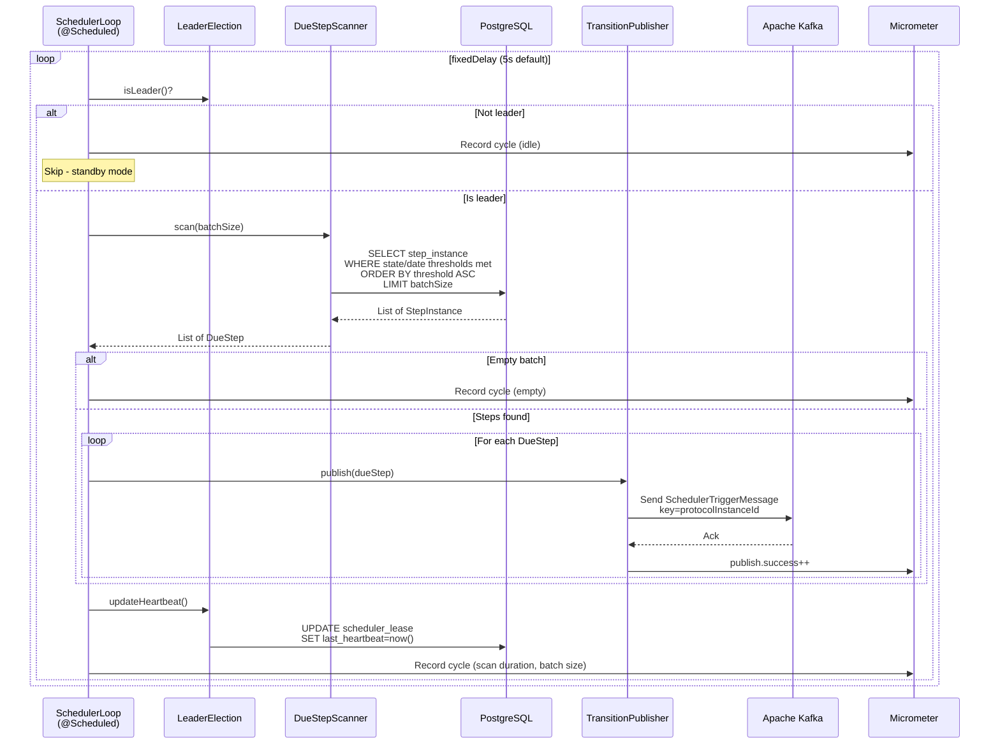
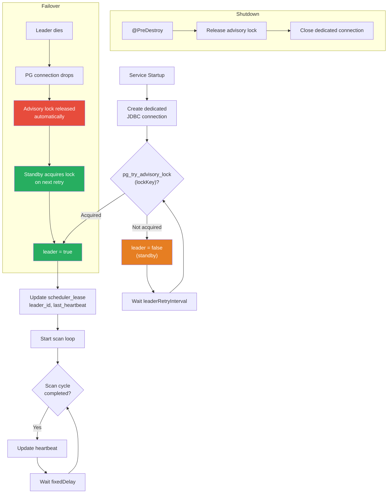
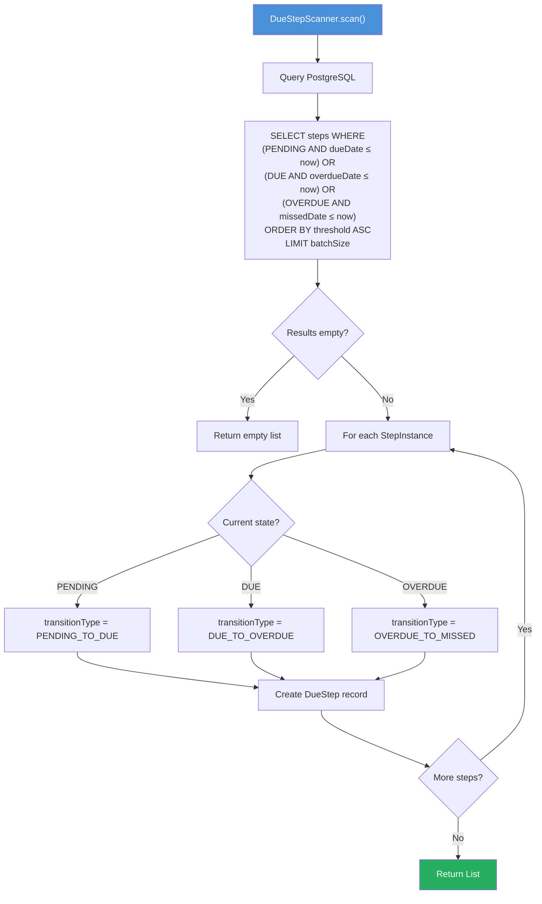
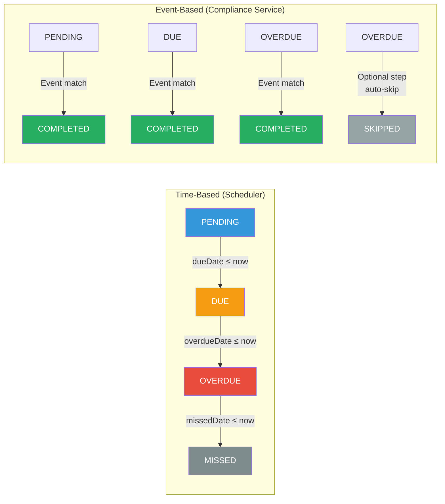
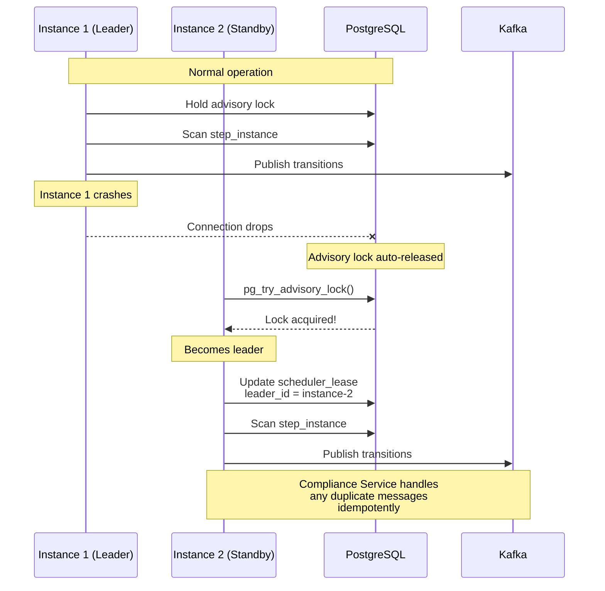

# CCE Scheduler Service — Flow Diagrams

All diagrams use Mermaid syntax for rendering in GitHub/IDE preview.

---

## 1. Scheduler Main Loop

The core scan-publish cycle that runs on every `fixedDelay` interval.

---

## 2. Leader Election Lifecycle

---

## 3. Due Step Scanning Algorithm

---

## 4. State Transition Determination

---

## 5. Failover Scenario

