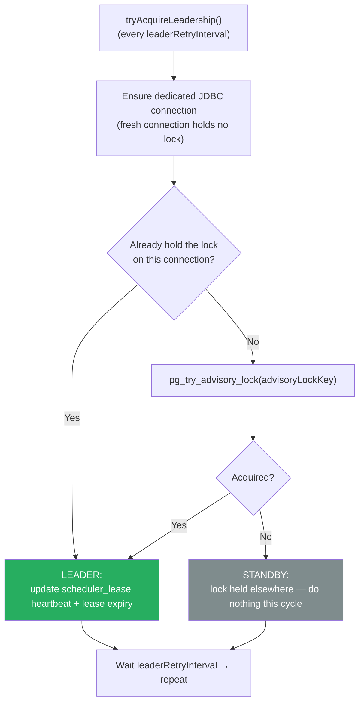
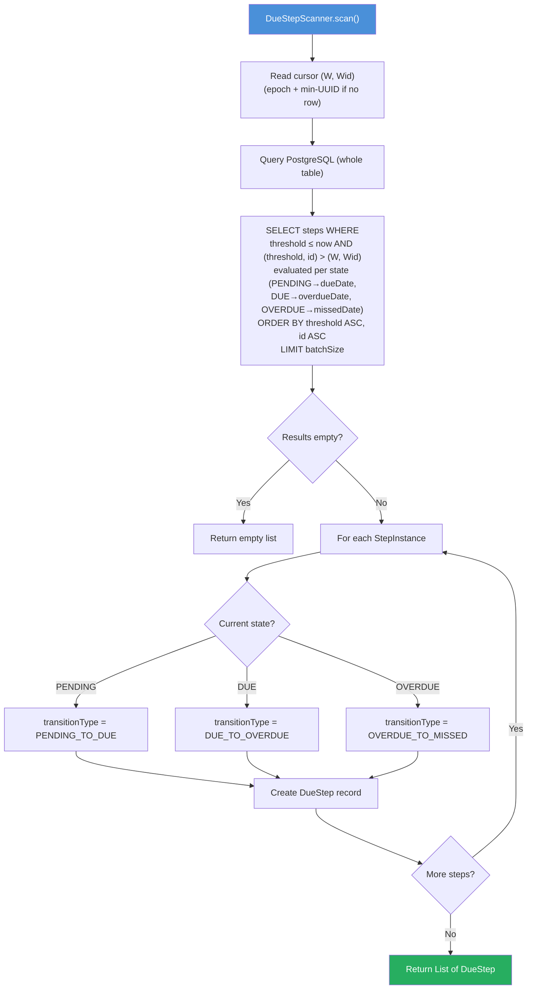
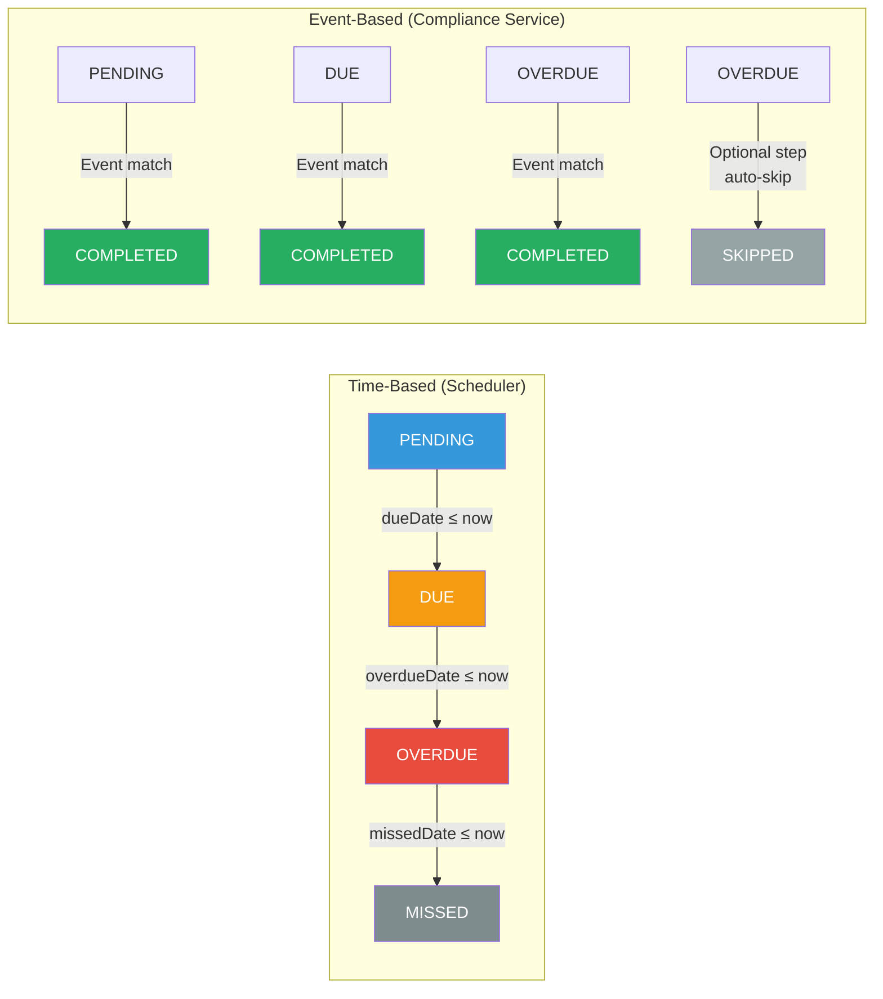
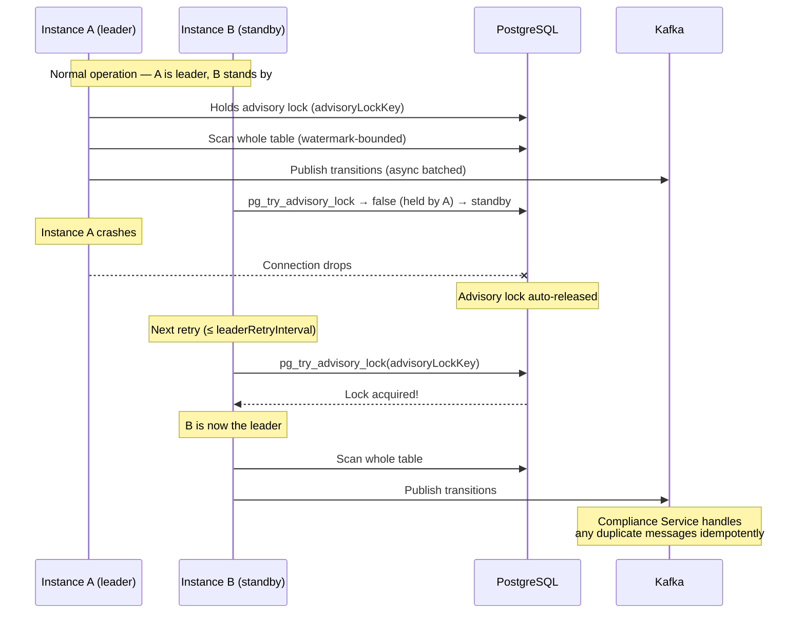

# CCE Scheduler Service — Flow Diagrams

Visual reference for the scheduler's runtime behavior: the main scan-publish loop, single-leader election, due-step scanning, state transitions, and failover.

---

## 1. Scheduler Main Loop

The core scan-publish cycle that runs on every `fixedDelay` interval. Only the instance holding the leader lock scans; the rest stand by.

```mermaid
sequenceDiagram
    participant SL as SchedulerLoop
    participant Leader as LeaderElection
    participant Scanner as DueStepScanner
    participant DB as PostgreSQL
    participant Publisher as TransitionPublisher
    participant Kafka as Kafka
    participant Metrics as Metrics

    loop Every fixedDelay (default 10s)
        SL->>Leader: isLeader()?
        alt Not leader
            Note over SL: Standby — skip cycle
        else Leader
            SL->>Scanner: scan()
            Scanner->>DB: SELECT watermark, watermark_id FROM scheduler_scan_cursor (epoch + min-UUID if none)
            Scanner->>DB: SELECT step_instance<br/>WHERE state/date thresholds met<br/>AND (threshold, id) &gt; (watermark, watermark_id)<br/>ORDER BY threshold ASC, id ASC<br/>LIMIT batchSize
            DB-->>Scanner: List of StepInstance
            Scanner-->>SL: List of DueStep

            alt Steps found
                SL->>Publisher: publishAll(dueSteps)
                Publisher->>Kafka: Fire all sends async (key=protocolInstanceId)
                Kafka-->>Publisher: Acks (awaited as a batch)
                Publisher->>Metrics: publish.success / publish.failure
                opt All published successfully
                    SL->>DB: UPSERT scheduler_scan_cursor<br/>SET (watermark, watermark_id) = last emitted (threshold, id)<br/>WHERE new &gt; old (monotonic)
                end
            end

            SL->>Metrics: Record cycle + scan duration
        end
    end
```

---

## 2. Single-Leader Election Lifecycle

One PostgreSQL advisory lock decides the single active leader; all other instances stand by and retry.



**Failover:** when the leader dies, its dedicated connection drops and PostgreSQL releases the advisory lock. A standby's next `pg_try_advisory_lock` succeeds (≤ `leaderRetryInterval`), promoting it. A `holdsLock` flag is reset whenever the connection is (re)established or dropped, so a silently-dropped connection can never leave a stale "still leader" belief.

---

## 3. Due Step Scanning Algorithm



> **(W, Wid)** = the keyset scan cursor `(threshold, step id)`. It is the exclusive lower bound in `(threshold, id)` order: the scan skips crossings already emitted in a prior cycle, and the UUID v7 `id` tie-breaker lets a same-timestamp cohort larger than `batch-size` drain across cycles (in creation order) rather than being truncated. `SchedulerLoop` advances the cursor to the last emitted `(threshold, id)` after a fully successful publish.

### Indexing & Query Optimization Notes

`step_instance` is owned by the Compliance Service; the Scheduler reads it. To keep the watermark-bounded scan efficient as the table grows, the ideal supporting indexes are **partial indexes on each threshold column with `id` as a trailing column**, so the `(threshold, id)` keyset seek is fully index-ordered:

```sql
CREATE INDEX idx_step_instance_pending_due   ON step_instance (due_date, id)     WHERE state = 'PENDING';
CREATE INDEX idx_step_instance_due_overdue   ON step_instance (overdue_date, id) WHERE state = 'DUE';
CREATE INDEX idx_step_instance_overdue_missed ON step_instance (missed_date, id) WHERE state = 'OVERDUE';
```

These are created by migration `V6__step_instance_scan_indexes.sql` (guarded by a table-exists check, `CREATE INDEX IF NOT EXISTS`, so they coexist with any Compliance-side indexes). UUID v7 ids are sequential, so they stay compact (append-mostly inserts). Verify efficiency after deploy with `EXPLAIN (ANALYZE, BUFFERS)` on the scan query.

---

## 4. State Transition Determination



The Scheduler only ever *requests* the time-based transitions (left). The Compliance Service is the sole writer of `step_instance.state` and decides the terminal outcome (MISSED vs SKIPPED by `requiredBehavior`, or COMPLETED on an event match).

---

## 5. Failover Scenario


