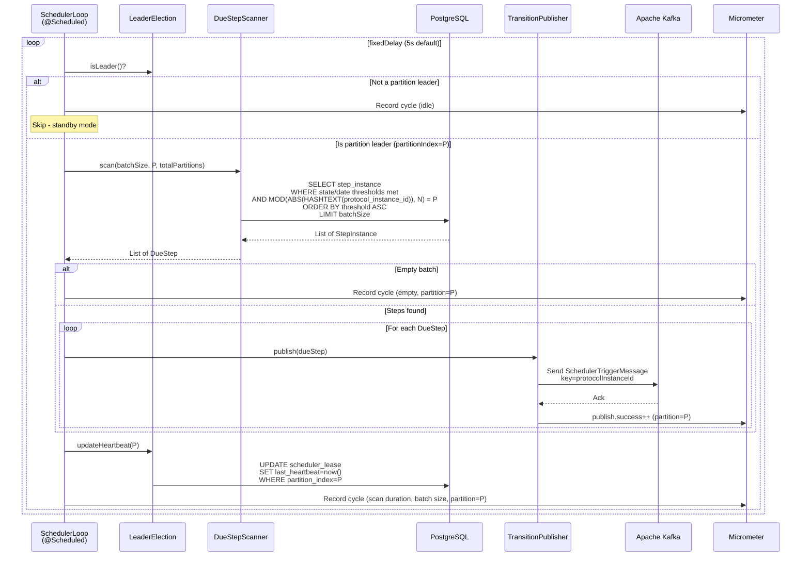
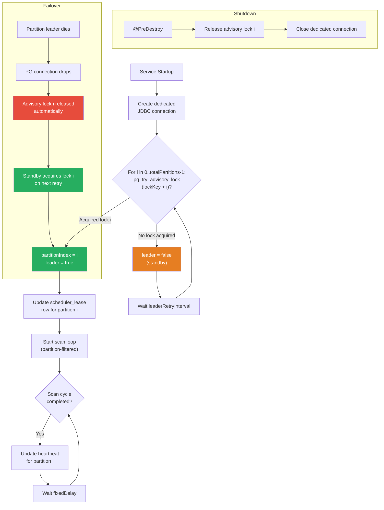
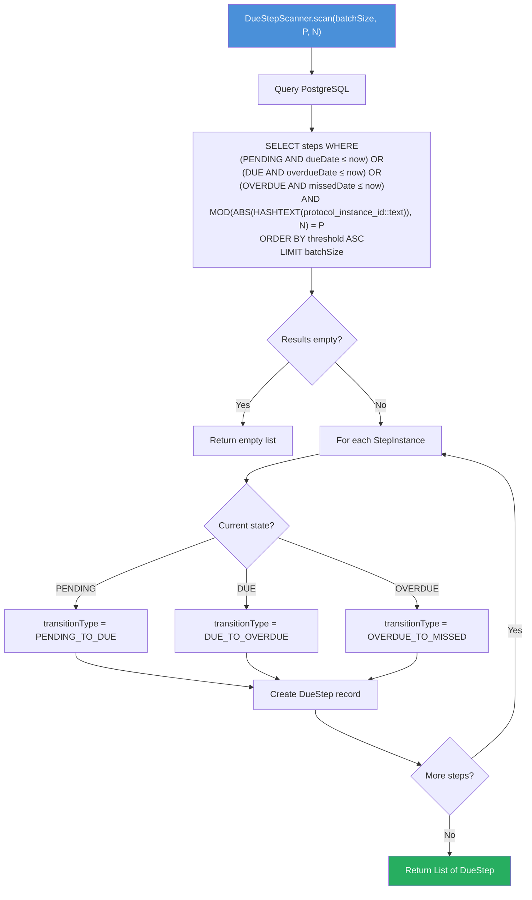
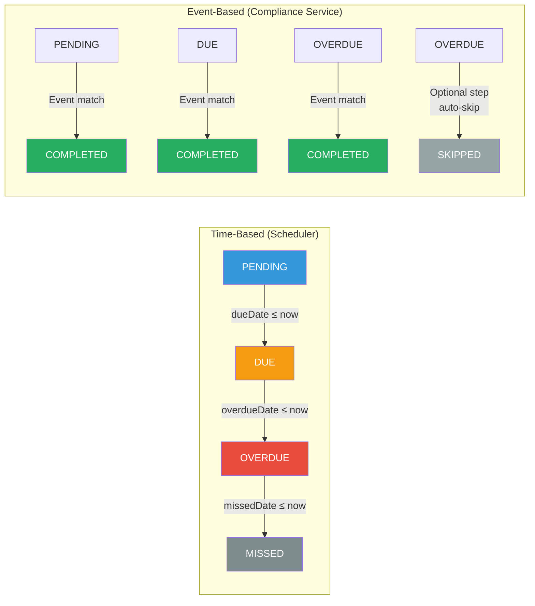
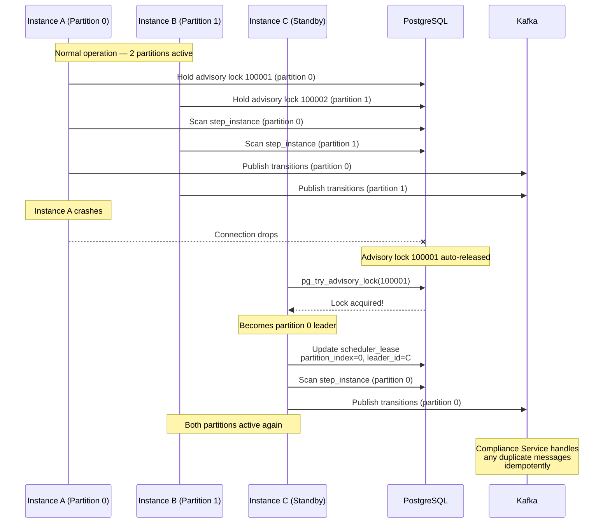

# CCE Scheduler Service — Flow Diagrams

All diagrams use Mermaid syntax for rendering in GitHub/IDE preview.

---

## 1. Scheduler Main Loop

The core scan-publish cycle that runs on every `fixedDelay` interval. Each instance scans only its assigned partition.

---

## 2. Partitioned Leader Election Lifecycle

---

## 3. Due Step Scanning Algorithm

> **P** = this instance’s `partitionIndex`, **N** = `totalPartitions`. When N=1, the `MOD(...)` clause is always 0 = P, effectively a no-op (full table scan).

---

## 4. State Transition Determination

---

## 5. Failover Scenario (Partitioned)

